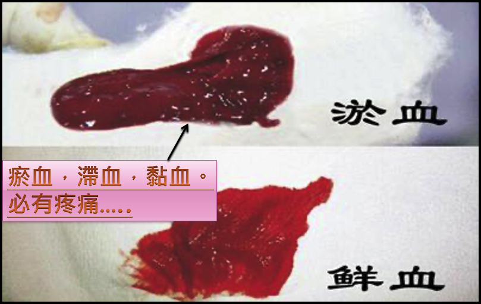

# 醫道探微 Exploring-the-Path-of-Medicine
這裡記錄了我個人在中醫世界的學習旅程，包括學習筆記、對陰陽、五行和經絡理論等關鍵概念的反思以及對草藥療法、針灸、拔罐、刮痧等其他中醫模式的探索。這是一個分享知識、促進討論和加深對這一引人入勝且複雜的醫學體系的理解的空間。

This repository documents my personal journey of learning and exploration within the world of Traditional Chinese Medicine (TCM). It includes study notes, reflections on key concepts such as Yin and Yang, the Five Elements, and Meridian theory, as well as explorations of various TCM modalities including herbal remedies, acupuncture, cupping, and gua sha. This space is dedicated to sharing knowledge, fostering discussion, and deepening understanding of this fascinating and complex medical system.

# 中醫參考資料庫
1. [醫砭](https://yibian.hopto.org/db/) - 中醫資料庫
2. [中醫百科](https://zhongyibaike.com/) - 中醫百科全書
3. [中醫英譯參考](TCM_Translate.md)
4. [中醫脈診專用術語](/images/中醫脈診專用術語.png)
5. [醫學與癌症專有名詞中英對照](https://drive.google.com/file/d/13yIE4uxYzl37t9itQB2VJkEZVjAngnfR)
6. [24節氣中英文對照](https://docs.google.com/document/d/1ttCfZuxex5yi9CPhQ_I9UcymR99KqOICH0KOCjcMG74)
7. [中醫常用83方劑](https://drive.google.com/file/d/1AW77uL_1f-sml_jSosjDs86AeEpCok7C)
8. [中医基础理论](https://www.zysj.com.cn/lilunshuji/jichulilun/index.html)
9. [線上中医书籍](https://www.zysj.com.cn/lilunshuji/index.html)
10. [中醫診斷學- 朱文鋒](https://youtube.com/playlist?list=PL4vrC2HG1WdSdehxB4jAV7Ac9dDXuEeyJ&si=DTVSl6-9qCmbY4j-)
11. [中医中药学79课-张廷模](https://youtube.com/playlist?list=PLvslYZmmMua7aLuCHNNg30dWsBk_BqKGY&si=XeqD_f8Nguw70Jpz)
12. [方剂学 邓中甲](https://youtube.com/playlist?list=PLOACcC0G6QXWe2Up0QN3Rh_XimUZjx7Yt&si=Fj7LRCxEndOyLtha)

# 活血化瘀
血液為生身之寶，循環良好亦為健康之本，然而人體五臟六腑必有瘀血，滯血，黏血。 
循環堵塞不暢，營養氧氣不能送到臟腑，新陳代謝的廢物不能排除，皆是為百病之源，故治病必治血。 
<b>活血化瘀治百病。</b>

### 活血化瘀的方法，血液順暢自然就不痛了。
- [刮痧](刮痧.md)
- [拔罐](拔罐.md)
- [中藥](中藥/活血化瘀药.md):常用的一味活血化瘀中藥 [延胡索](https://yibian.hopto.org/db/?yno=77)
- 推拿
- 針灸

## [中醫診斷方法](中醫診斷/中醫診斷.md)
「望聞問切」（wàng wén wèn qiè）是中醫傳統的四大診斷方法，簡稱為「四診」。這是中醫診斷的基礎，幫助醫師全面了解患者的健康狀況，從而做出準確的診斷和治療方案。

### 警告: 本文是筆者個人閱讀及學習的筆記，內容僅反映本人對中醫知識的理解與認知。如有他人根據本文內容進行醫療行為，所產生的任何後果，筆者不承擔任何責任。使用者需謹慎，並諮詢專業中醫師的建議。
### Warning: This article consists of personal notes from my readings and studies, reflecting only my understanding and perceptions of Traditional Chinese Medicine (TCM) knowledge. I do not assume any responsibility for the consequences of others using this content for medical practice. Users should exercise caution and consult with a professional TCM practitioner.

## 特別感謝恩師 - [張蔚炎中醫師](中醫師張蔚炎.md)
本人於2024年拜師於張醫師門下，故文章裡有多處引用師父的著作【脈診發微】及上課資料，期將師父的理念廣為流傳。