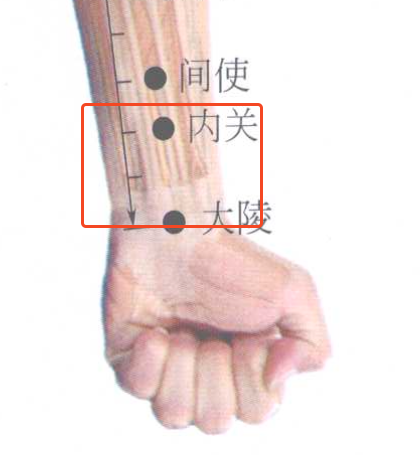
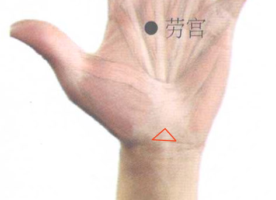
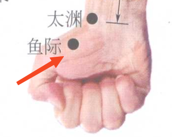
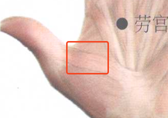
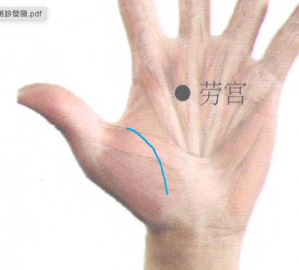
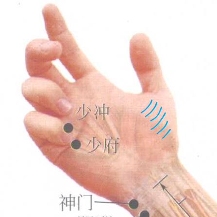
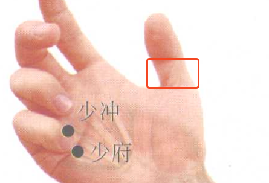
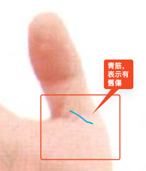

# 手掌望診

## 內關區
  
- 貧血：觀察內關區域的血色，如果偏白、偏黃就是貧血。
- 青筋明顯（女）月經排不乾淨，用少腹逐瘀汤，桃红四物汤來清理月經【懷孕不能用】（年紀大或男生不管），治療不孕要從清理下手，先把子宮裡的瘀血清乾淨。
- 情緒緊張（Emotional tension），容易緊張的人。躁鬱或鬱悶從脈象或血壓看。

## 三角區
 
三角形區域主管生殖泌尿系統：如果有怪怪的東西或三角紋，可能有問題
- 女：卵巢囊腫（ovarian cyst），需要從耳穴或脈象印證
- 男：前列腺（prostate），需要從耳穴或脈象印證
## 手掌區
 
### 外側
- 紅：肝不好，紅點或黑點更不好，把脈時要注意【左關，肝】
- 紅腫：小心血糖，少碳水【右關】肝病不一定有症狀，就會疲勞而已。

### 魚際區 YUJI

 
- 女大拇指內側深紅：乳房（breasts）有東西，兩手皆適用。嚴重荷爾蒙異常才把脈把的出來，看耳穴較容易判別。

 
- 青筋沿生命線：虧損，脈象沉是焦慮（anxiety）；脈象浮是壓力、勞累。
	- 蒼白、血壓低、心跳快、脾氣不好，表示虧損。左關脈象沉，是焦慮。
	- 蒼白、血壓低、心跳快、脾氣不好，表示虧損。左關脈象浮，是壓力或太累，心力透支。

 
- 青筋多條橫紋：胃寒，消化功能不好（digestion）；胃寒+外側肝火：自律神經失調（Dysautonomia）

 
- 肉下陷：肺虛虧損（Lung deficiency）。肺、感冒
- 大拇指腰：細，消化不良（indigestion）；粗，脂肪肝（fatty liver） 
 
- 大拇指腰有青筋表示有舊傷或是女性剖腹產注射

### 手指區域，雙手五指
- 形狀：頸椎
- 顏色：指尖紅，頭有火氣（internal heat）
- 關節
	- 褐色，鐵質沈澱（Iron deposits）
	- 青筋褐筋，膽固醇過高(cholesterol)
	- 節間肉太胖（barrel），脂肪肝（fatty liver）【左關，凹】
- 指尖形狀：肥大或粗，腦袋有問題；太窄，頭部受過傷、眩暈。【右寸】
- 指甲
	- 凹陷：嚴重免疫系統疾病 immune system，虧損 deficiency
	- 突起：肺部積水 Cardiogenic Pul. Edema，末梢循環水腫 peripheral circulation edema
	- 顏色：黑，瘀血 blood stasis；白，貧血 anemia
	- 半黏：氣血兩虧 deficiency
### 手肘
- LU：青筋或褐色表示呼吸系統弱 respiratory system deficiency
- PC：青筋或褐色表示情緒不好 bad mood ，內關也有，情緒低落 depression
- HT：青筋或褐色表示心臟不好 heart condition
### 前臂
- 顏色暗沉可能有皮下水腫(edema)，暗下去會變白，貧血的比較不會有
### 小腿
- 觀察小腿顏色，壓小腿內側骨頭部分，看反彈情況
### 天突穴
- 冷的是氣管炎trachitis
- 熱的是氣喘asthma
- 按下去很痛可能代表懷孕
### 大椎穴
