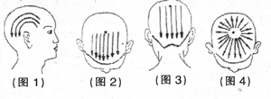

# 人體不同部位的刮痧療法
在元明時期，已經記錄了許多使用瓷勺刮背來驅散邪氣的療法。到了清代，不僅《理浴駢文》等書籍中有記載關於刮痧的症狀，還出現了專門講述刮痧的書籍，如《七十二種痧症救治法》對刮痧療法的理論和操作進行了全面和系統的描述。

## 頭部刮痧法

頭部刮痧使用的刮痧板是由具有活血潤養功效的天然牛角製成，一端是梳型設計，用於疏通頭部經絡；另一端是波浪型，適用於點按頭部相應的穴位。由於頭部被頭髮覆蓋，刮痧時應在頭髮上面進行面刮法，無需塗抹刮痧潤滑劑。為了增強刮拭效果，可以使用刮板的薄邊緣或角部進行刮拭，每個部位大約刮30次，直至頭皮產生發熱感為止。如果患有出血性疾病，如血小板減少症，無論是頭部還是其他部位都不應進行刮痧。若有神經衰弱，建議選擇在白天進行頭部刮痧。

經常進行頭部刮痧可以促進頭部血液循環，有助於消除疲勞、頭痛並改善大腦的血液供應。定期進行頭部刮痧有助於增進頭部的血液流通，能有效減輕疲勞和頭痛，同時也有助於改善大腦的血液供應。

### 頭部刮痧的穴位與操作方法可概括如下：
- 太陽穴：使用刮板的角部，由前向後或由上至下輕刮。
- 頭部兩側：將刮板豎直置於頭維穴至下關角之間，沿著耳上髮際線往後下方刮至後髮際。
- 頭頂部：以百會穴為基準，或從百會穴往前額髮際刮，或由前額髮際向百會穴刮，自左向右依序進行。
- 後頭部：從百會穴往下刮至後頸部髮際，自左至右循序進行；遇到風池穴可使用刮板的角部重點刮拭。
- 放射狀刮拭：也可選擇以百會穴為中心，向四周呈放射狀進行刮拭。

## 面部刮痧法

面部刮痧能顯著改善臉部皮膚狀況，尤其在緩解眼袋、黑眼圈以及斑點、痘痘等常見問題方面成效突出，同時也能預防並調理眼部、鼻部、耳部疾病，以及面癱、雀斑等五官相關病症。刮拭動作刺激面部的經絡穴位，產生熱效應，促使局部血液供應和血容量增加，進而活化受損和衰弱細胞，加快代謝廢物的排出，同時推動組織的氧化、修復與更新。最終便可達到排毒養顏、舒緩皺紋、活血除瘡、抗氧嫩白、行氣消斑、保護和美化膚質的多重功效。

面部刮痧時，建議依據面部的生理結構，選用S形或小型多功能刮痧板，配合適宜的手法，沿著面部特定經絡穴位進行刮拭。透過此過程，能有效暢通血脈、行氣活血、疏通毛孔、排出痧氣並調整面部的生物信息以及平衡陰陽。

在操作面部刮痧時應特別注意手法輕柔，毋須過度用力。由於面部皮膚較為敏感且常年暴露於外，不同於其他身體部位，不必追求刮出明顯的「痧斑」，只要感受到有溫熱效應、痧氣排出即可。大多數人在受施後，臉部會出現微熱感，彷彿剛經過蒸臉或熱敷的狀態；少部分人在面頰、髮際等處可能感受到輕微的跳動或蟻行感，有些人還會因血液循環增加而感到心情愉悅。通常大部分受術者的臉部在出現紅熱感後能迅速恢復，再來便會有一種舒暢輕盈，並恢復自然白裡透紅膚色的感受。

至於眼、耳、口、鼻等部位，可改以手指刮摩的方式進行，取代使用刮痧板。
### 操作方法

1. 先在整個臉部均勻塗抹按摩精油。
2. 以刮痧板輕輕按壓臉部穴位，從下往上依序刺激：承漿、兩側地倉、兩側迎香、巨髎、顴髎、兩側鼻通、睛明、印堂、攢竹、魚腰、絲竹空、瞳子髎、球後、承泣、四白和太陽。
3. 接著，用刮痧板在面部穴位上進行點按，依序包括：印堂、髮際、攢竹、髮際、魚腰、髮際、絲竹空、髮際、太陽、聽會、聽官以及耳門。
4. 接著進行刮痧，路線與順序如下：
	- 承漿 → 聽會
	- 地倉 → 聽會
	- 人中 → 聽會
	- 迎香 → 聽會
	- 鼻通 → 耳門
	- 睛明 → 耳門
	- 攢竹以下 → 太陽穴
	- 額頭分三段 → 太陽穴
5. 接著使用刮痧板在整個臉部輕柔地按撫。
6. 再度沿著上述步驟中的刮痧路線刮拭，這次從額頭往下頜的方向，由第8條線至第1條線進行。最後可分別提拉左臉頰及右臉頰。

## 頸部刮痧法
### 頸部刮痧的基本步驟如下:
1. 先讓受術者俯臥,臉部朝下並維持肌肉放鬆。可以在胸前墊個枕頭,方便刮痧板接觸頸部穴位。
2. 在刮痧部位薄薄塗抹刮痧油,並用刮板均勻推開。
3. 首先刮頸部正中的督脈路線,並務必從髮際內開始,因為頸椎第一節位置相對較高,尤其是有頭部不適者,更需從最高處刮起,才能有效刺激第一節頸椎。
 - 一手輕扶受術者額頭,一手由上往下刮拭頸部,加大壓力時要視對方的耐受度而定,但仍需適當下壓。
 - 當毛孔已張開或不再出痧時即可停止,然後換到下一個區域繼續刮。
 - 低頭時在頸後最突出的部分是第七頸椎(大椎穴),頸部刮痧一般需刮至此處即可。
4. 接著刮頸部兩側的膀胱經。手法是中指抵住刮痧板兩角之間的位置,兩角同時刮頸的左右兩側,一樣要稍微下壓並保持適度力度。
5. 最後,用刮痧板的單角由上往下刮頸部外側(膽經)。可先處理風池穴,很多人在這裡會感到疼痛,尤其有頭部不適、感冒頭痛或高血壓頭痛、頸椎問題等情況時,更可能出現明顯痛感。然後再往下沿著膽經繼續刮,這裡的肌肉較易緊繃,可用按揉的方式輕刮,避免用力過猛。
6. 每次刮完後,应間隔五至七天,等痧完全退去才能進行下一次刮痧,大約一週一次。等到不再出痧且症狀消失後,可改為每天簡單刮拭,這時無須再使用刮痧油,隔著衣服操作即可。

## 背部刮痧法

## 胸部刮痧法

## 腹部刮痧法

## 四肢刮痧法

## 耳部刮痧法

### [刮痧基本知識](刮痧.md)																	