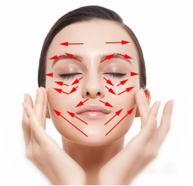

# 人體不同部位的刮痧療法
在元明時期，已經記錄了許多使用瓷勺刮背來驅散邪氣的療法。到了清代，不僅《理浴駢文》等書籍中有記載關於刮痧的症狀，還出現了專門講述刮痧的書籍，如《七十二種痧症救治法》對刮痧療法的理論和操作進行了全面和系統的描述。

## 頭部刮痧法

頭部刮痧使用的刮痧板是由具有活血潤養功效的天然牛角製成，一端是梳型設計，用於疏通頭部經絡；另一端是波浪型，適用於點按頭部相應的穴位。由於頭部被頭髮覆蓋，刮痧時應在頭髮上面進行面刮法，無需塗抹刮痧潤滑劑。為了增強刮拭效果，可以使用刮板的薄邊緣或角部進行刮拭，每個部位大約刮30次，直至頭皮產生發熱感為止。如果患有出血性疾病，如血小板減少症，無論是頭部還是其他部位都不應進行刮痧。若有神經衰弱，建議選擇在白天進行頭部刮痧。

經常進行頭部刮痧可以促進頭部血液循環，有助於消除疲勞、頭痛並改善大腦的血液供應。定期進行頭部刮痧有助於增進頭部的血液流通，能有效減輕疲勞和頭痛，同時也有助於改善大腦的血液供應。

### 頭部刮痧的穴位與操作方法可概括如下：
- 太陽穴：使用刮板的角部，由前向後或由上至下輕刮。
- 頭部兩側：將刮板豎直置於頭維穴至下關角之間，沿著耳上髮際線往後下方刮至後髮際。
- 頭頂部：以百會穴為基準，或從百會穴往前額髮際刮，或由前額髮際向百會穴刮，自左向右依序進行。
- 後頭部：從百會穴往下刮至後頸部髮際，自左至右循序進行；遇到風池穴可使用刮板的角部重點刮拭。
- 放射狀刮拭：也可選擇以百會穴為中心，向四周呈放射狀進行刮拭。

## 面部刮痧法

面部刮痧能顯著改善臉部皮膚狀況，尤其在緩解眼袋、黑眼圈以及斑點、痘痘等常見問題方面成效突出，同時也能預防並調理眼部、鼻部、耳部疾病，以及面癱、雀斑等五官相關病症。刮拭動作刺激面部的經絡穴位，產生熱效應，促使局部血液供應和血容量增加，進而活化受損和衰弱細胞，加快代謝廢物的排出，同時推動組織的氧化、修復與更新。最終便可達到排毒養顏、舒緩皺紋、活血除瘡、抗氧嫩白、行氣消斑、保護和美化膚質的多重功效。

面部刮痧時，建議依據面部的生理結構，選用S形或小型多功能刮痧板，配合適宜的手法，沿著面部特定經絡穴位進行刮拭。透過此過程，能有效暢通血脈、行氣活血、疏通毛孔、排出痧氣並調整面部的生物信息以及平衡陰陽。

在操作面部刮痧時應特別注意手法輕柔，毋須過度用力。由於面部皮膚較為敏感且常年暴露於外，不同於其他身體部位，不必追求刮出明顯的「痧斑」，只要感受到有溫熱效應、痧氣排出即可。大多數人在受施後，臉部會出現微熱感，彷彿剛經過蒸臉或熱敷的狀態；少部分人在面頰、髮際等處可能感受到輕微的跳動或蟻行感，有些人還會因血液循環增加而感到心情愉悅。通常大部分受術者的臉部在出現紅熱感後能迅速恢復，再來便會有一種舒暢輕盈，並恢復自然白裡透紅膚色的感受。

至於眼、耳、口、鼻等部位，可改以手指刮摩的方式進行，取代使用刮痧板。
### 操作方法

1. 先在整個臉部均勻塗抹按摩精油。
2. 以刮痧板輕輕按壓臉部穴位，從下往上依序刺激：承漿、兩側地倉、兩側迎香、巨髎、顴髎、兩側鼻通、睛明、印堂、攢竹、魚腰、絲竹空、瞳子髎、球後、承泣、四白和太陽。
3. 接著，用刮痧板在面部穴位上進行點按，依序包括：印堂、髮際、攢竹、髮際、魚腰、髮際、絲竹空、髮際、太陽、聽會、聽官以及耳門。
4. 接著進行刮痧，路線與順序如下：
	- 承漿 → 聽會
	- 地倉 → 聽會
	- 人中 → 聽會
	- 迎香 → 聽會
	- 鼻通 → 耳門
	- 睛明 → 耳門
	- 攢竹以下 → 太陽穴
	- 額頭分三段 → 太陽穴
5. 接著使用刮痧板在整個臉部輕柔地按撫。
6. 再度沿著上述步驟中的刮痧路線刮拭，這次從額頭往下頜的方向，由第8條線至第1條線進行。最後可分別提拉左臉頰及右臉頰。

## 頸部刮痧法
### 頸部刮痧的基本步驟如下:
1. 先讓受術者俯臥，臉部朝下並維持肌肉放鬆。可以在胸前墊個枕頭，方便刮痧板接觸頸部穴位。
2. 在刮痧部位薄薄塗抹刮痧油，並用刮板均勻推開。
3. 首先刮頸部正中的督脈路線，並務必從髮際內開始，因為頸椎第一節位置相對較高，尤其是有頭部不適者，更需從最高處刮起，才能有效刺激第一節頸椎。
 - 一手輕扶受術者額頭，一手由上往下刮拭頸部，加大壓力時要視對方的耐受度而定，但仍需適當下壓。
 - 當毛孔已張開或不再出痧時即可停止，然後換到下一個區域繼續刮。
 - 低頭時在頸後最突出的部分是第七頸椎(大椎穴)，頸部刮痧一般需刮至此處即可。
4. 接著刮頸部兩側的膀胱經。手法是中指抵住刮痧板兩角之間的位置，兩角同時刮頸的左右兩側，一樣要稍微下壓並保持適度力度。
5. 最後，用刮痧板的單角由上往下刮頸部外側(膽經)。可先處理風池穴，很多人在這裡會感到疼痛，尤其有頭部不適、感冒頭痛或高血壓頭痛、頸椎問題等情況時，更可能出現明顯痛感。然後再往下沿著膽經繼續刮，這裡的肌肉較易緊繃，可用按揉的方式輕刮，避免用力過猛。
6. 每次刮完後，应間隔五至七天，等痧完全退去才能進行下一次刮痧，大約一週一次。等到不再出痧且症狀消失後，可改為每天簡單刮拭，這時無須再使用刮痧油，隔著衣服操作即可。

## 背部刮痧法

背部保健至關重要。在傳統的刮痧保健中，背部刮痧不僅扮演診斷與治療的雙重角色，也兼具保健作用，需要講究一定的方法、技巧與規律。由於五臟六腑都透過神經與脊柱相連，這些神經穿行於背部肌肉之間以支配臟腑，而不同臟腑對應於脊椎上的特定區域，稱作「脊椎對應區」。例如，心臟對應特定區域，肺臟、肝臟、脾臟或胰腺也各自有相應的脊椎區域。

背部刮痧時，通常以脊柱為中心，向兩側各延伸約三寸，用以調節背部肌群。倘若背部肌肉過於緊張或僵硬，可能壓迫血管和神經，進而影響臟腑健康；擴大刮拭範圍，使肌肉得到放鬆，就能逐漸改善臟腑的亞健康問題。背部正中的督脈及兩側的膀胱經，是刮拭的主要區域；施術後可透過出現痧的部位(陽性反應)來判斷五臟六腑的健康狀態。背部與臟腑關係密切，背部刮痧因為接觸範圍廣、離臟腑更近，對臟腑保健具明顯功效，是調理亞健康體質的捷徑。若同一位置反覆出現相同的痧象，表示該器官相對較脆弱，應該引起注意。

個體生命走向終結，多半是因某個臟器率先衰竭，而非所有器官同時出現問題。這個最先發生故障的部位通常是功能較弱的臟腑。透過背部刮痧了解自身薄弱的器官後，重點關注並加以調養，即可延緩該器官的衰老速度，也能進一步提升整體壽命。

背部刮痧對部分心、肺、肝、膽、脾、胃等臟腑處於亞健康狀態的人群頗具調理效果。例如，經常胸悶、氣短、咳嗽、咽喉炎等慢性症狀，或時常情緒不穩、易怒抑鬱(肝火旺盛)，又或是消化不良、食欲差、進食後腹脹，甚或「喝口涼水都長肉」 (脾運化功能不佳) 等情況，都可以借助刮痧進行保健調整。即便臟器已經出現病變，背部刮痧也能起到一定的輔助治療作用。然而，針對心功能衰竭等嚴重疾病，仍需在醫院並遵照專業醫師的建議進行綜合治療，不宜單獨接受刮痧。若背部有痤瘡或皮膚感染，施術時需格外謹慎。此外，刮痧的力度必須掌握恰當:對於過於消瘦、近乎皮包骨的人，應以輕柔方式刮拭，以免造成對骨骼或皮膚的傷害。

### 背部刮痧的基本步驟如下:

1. 背部刮痧時，一般讓受術者面向椅背坐下，雙臂張開並趴在椅背上，以使背部肌肉盡可能放鬆。先在背部塗抹刮痧油後，再開始施術。
2. 整體刮拭方向通常採用自上而下的方式，先處理中間區域，再刮兩側；若針對骶部，則改為由下而上，並從較輕的力道逐漸加重。
3. 可將兩側肩胛骨下角的連線視為分界，將背部分成上下兩區:上部對應心、肺，下部對應肝、膽、脾、胃。操作時，先刮上部—由中央至兩側、由頸部大椎穴向下，以五寸左右的短線條刮拭，刮痧板的前端稍微上翹。接著向下推進至肝、膽、脾、胃所在區域，之後使用刮痧板的兩角對外側進行刮拭。最後，順著肋骨的走向由內向外刮，刮板角度盡量貼近皮膚。
4. 左側對應脾胃及胰腺投影區，適度刮拭有強健脾胃並預防糖尿病的功效；右側對應肝膽區域，現代人容易情緒抑鬱、愛發脾氣，多與肝鬱氣滯有關，經常刮拭此處可起到疏肝解鬱的作用。
5. 在實際操作時，務必運用較大的壓力，以刺激經脈導通，並調節臟腑功能。刮完後用按揉的方式將背部殘留的刮痧油擦去，有助於使已打開的毛孔迅速閉合。

### 背部刮痧時的注意事項

1. 保暖並避免風寒:施術時應盡量避免直接受到冷風吹拂，並在相對溫暖的環境下進行，防止寒氣侵入。

2. 控制刮痧時長:單次刮痧建議以二十分鐘為限，若需處理的穴位較多，可分次進行，以免過度疲勞或刺激。

3. 避免體虛和空腹施術:體質虛弱者不宜採用過度瀉刮法；空腹或剛經歷過度疲勞時也應避免施作利疹。

4. 補充水分並留意飲食:刮痧後宜喝一杯水，加速代謝產物排出。應避免進食生冷食物，並在刮痧後約四小時後再以溫熱水洗浴。

5. 初次施術力道宜輕:對第一次接受刮痧的人，應減少力道，盡可能避免留下較重的瘀痧。

6. 特殊人群需謹慎:月經期、懷孕期、嚴重心臟病及身體虛弱者，須以輕柔緩慢的手法進行；施作時應遠離空調或風扇等冷風，並在經絡疏通後的四小時內避免洗澡。護理期間不吃刺激性食品，儘量少喝酒。做完背部刮痧後要多補充水分，以協助身體排毒。

## 胸部刮痧法

胸部刮痧在傳統刮痧保健中雖然較少被應用，但實際上相當方便，因為多數情況下可自行操作，主要針對肋骨區域。胸部刮痧與背部刮痧一樣，能調節心、肺、肝、膽、脾、胃等臟腑，並有助於預防支氣管炎、哮喘、乳腺炎或乳腺癌等問題。胸部也是多種臟腑器官的體表投影區，分布著重要的經脈；位於正中的任脈更是關係著全身臟腑功能。由於任脈屬於陰經主脈，對陰虛易上火者而言，刮拭該區以補陰頗具成效，並能同時提升滋陰補腎的效果。

在施行胸部刮痧時，面積不必十分精準，建議稍加擴大，覆蓋超出預期範圍即可。例如心臟的體表投影區不易確定，便可多刮幾處上下左右徑域，確保涵蓋整個區域。由於胸部為肋骨位置所在，通常的刮拭方向是從上往下，但在肋骨兩側宜左右橫向大面積刮拭。若體型較瘦，需減輕力道並縮短時間，以免傷及骨膜；即使是一般體質，也不建議在肋骨區長時間刮拭，感覺毛孔微開即可停止，以免軟組織受損。另外，乳頭區須避免直接刮拭。如果出現過度刺激，通常不需特殊處理，可在12小時內進行局部熱敷來緩解疼痛。還需注意，空腹、熬夜後和大量流汗或劇烈運動後皆不宜刮痧，因為此時身體狀態疲憊，容易出現暈眩或其他不適。

### 胸部刮痧的操作方法

胸部刮痧時，可以選用多功能牛角刮痧板或腎形牛角刮痧板等工具。在塗抹好刮痧油之後，首先從中間的任脈開始刮拭，使用刮痧板的單一角端從上向下輕柔地刮。由於胸部皮膚較薄且敏感，對疼痛感較為敏感，因此刮拭時動作需輕柔且緩慢。上方區域對應心肺等重要器官，可以特別注意刮拭羶中穴以補充氣血，這對調節氣息不順、胸悶和氣短等症狀特別有幫助。羶中穴下方則是胃的體表投影區，中間部分刮完後再刮兩側。

對於被刮者的左側，即心臟的體表投影區，以及右側的肺的體表投影區，應從內向外以橫向刮拭，採用平刮法並沿著肋骨的走向進行，保持刮痧板角度小且速度慢，同時注意避開乳頭區域。左側下半部分對應脾臟和胰腺的體表投影區，從內向外分段橫向刮拭，一直到胸部與腹部的分界中線，與背部刮痧相連，形成完整的健脾健胃的刮痧方法。

右側則是肝膽的體表投影區，採用相同的刮拭方法，這有助於疏通肝膽，促進肝膽健康。

## 腹部刮痧法

現代人對於減肥有著高度的熱情。事實上，許多人其實並不算過度肥胖，只是腹部脂肪較多，因此針對腹部的減重尤為重要。然而，對於腹部肥胖，減重不應是唯一的目標。有句俗語說:“腰圍越粗，壽命越短。”這是因為腰腹部是許多經脈的交匯處，這些經脈對身體的影響極大，其範圍遍及全身，腹部是人體的關鍵中樞。

當一個人體型較大，腹部脂肪過多時，這些脂肪會對腹部的經脈造成壓迫，阻礙氣血的正常流動，容易導致瘀滯。一旦這個中樞部位出現瘀滯，不僅會影響身體上下部的氣血供應，還會妨礙廢物的排出。因此，體型較大的人容易出現頭暈、心臟病、脂肪肝等健康問題，腿部和膝關節也可能因此而疼痛。

### 腹部刮痧的操作方法

腹部刮痧通常採用從上向下的刮拭方式。然而，在某些特殊情況下，如個別人出現胃下垂或其他內臟下垂的問題，則需要改為從下向上刮拭。對於一些頑固性便秘，則應按照大腸的走向進行刮痧。當刮拭升結腸時，應從下向上進行；而在刮橫結腸時，則應從右側向左上方刮拭。

腹部刮痧的操作相對簡單，若目的是為了減肥，可以每日進行刮痧。刮痧時，關鍵在於腹部需要進行適度收縮，這樣反復刮拭不僅有助於促進脂肪燃燒，還能發揮一定的保健效果。

## 四肢刮痧法

中醫認為，人體的四肢與五臟之間有著密切的聯繫，彼此相互影響。如果某個臟腑出現問題，四肢的關節也會有所反應。因此，對四肢關節進行刮拭和調理可以促進內臟的健康。經絡的功能在於「連接臟腑，網絡肢節」，使整個身體形成一個統一的系統。因此，我們可以通過「查外而治內」的方式，將內部的問題反映在外部。

透過對身體外部的治療，可以影響內部的健康狀態。因此，對四肢進行刮拭能夠對內臟起到保健的效果。如果四肢出現問題，通常會在面部有所顯現。左右兩側的上肢分別對應著左右兩頰。許多人在兩頰上容易出現斑點，且這些斑點往往難以去除。根據全息經絡的理論，這表明上肢可能存在問題。上肢與頸部及頸椎相連，因此，兩頰長斑的人通常也會有頸肩部的問題。

實際上，兩頰的斑點是頸肩部氣血瘀滯的表現。現代女性的兩頰上斑點越來越多，這與她們的生活習慣及穿著方式密切相關。現代人長時間使用電腦，往往忽視肩頸的保養。特別是辦公室的白領，長時間保持同一姿勢，導致肩頸肌肉緊張、僵硬和痙攣，隨著時間的推移，這裡的經絡氣血流動受到阻礙，容易造成氣血的瘀滯，最終在面部表現為兩頰的斑點。

面部的嘴角兩側區域與下肢相對應。要評估一個人的腿部健康，其實不必直接觀察腿部，只需注意這個區域即可。許多人在這兩個部位的皮膚顏色暗淡無光，這類人往往腿部感到酸軟無力，甚至出現沉重感，嚴重者可能會有膝關節疼痛等問題。這些情況都能在面部表現出來。因此，若想消除兩頰的斑點，讓面頰下部紅潤起來，只需疏通四肢的氣血經絡，面部的問題便能迎刃而解。換句話說，想要美容，首先要關注自身的健康，同時調理面部與身體。

四肢與臟腑之間的關係也非常密切。手臂內側有三條經絡，外側同樣有三條經絡，上肢共計六條經絡，下肢也有六條經絡，這些經絡分別連接著人體的五臟六腑。因此，通過刮拭四肢，能夠有效調節臟腑的功能。手臂和下肢的內側走的是陰經，而外側則是陽經。陰經與五臟相連，陽經則與六腑相連。

刮拭上肢內側從上到大拇指的線條可以檢查肺的健康狀況；從中指到小指的線條則可檢查心臟的健康；上肢外側從食指的線條可檢查大腸，中間到無名指的線條可檢查三焦，下面到小指外側的線條則可檢查小腸。在進行上肢刮拭時，特別要注意肘窩。由於關節活動頻繁，能量消耗較大，若氣血不足，這裡可能會出現不適。對於氣血虧虛的人，這個部位容易出現問題，因此可以在此塗抹一些舒緩油後進行推拿。拍打肘窩時，手臂應先伸直，再放鬆，將手臂放在桌子或床上，均勻塗抹油脂，然後彎曲手臂，使用另一隻手掌握刮痧板進行拍打。

同樣，拍打膝窩也非常重要。膝窩的經脈貫穿全身，若出現瘀滯，將影響多個部位的健康。哪些人適合經常拍打膝窩呢？例如有黑眼圈、頭部不適、高血壓、頭暈、頭痛、脖子後面疼痛，或背部、腰部、腿部疼痛以及腿部容易抽筋的人。膝窩和肘窩都是非常重要的部位，這兩處的穴位形成合穴，猶如河流匯入大海的閘門，若這些穴位出現阻塞，則氣血無法順利流入五臟六腑。人體衰老的一個重要表現是肢體的靈活性下降和僵硬，這通常是因為筋骨失去柔韌性。人的衰老從“筋”開始，而肝主筋，肝膽相連，肝經位於腿部內側的中線，與褲子內側的縫線平行；膽經則位於腿部外側的中線，與褲子外側的縫線平行。幾乎全身的疼痛都與膽囊有關，肝經和膽經也與人體的衰老密切相關。保養這兩條經脈有助於延緩衰老。

腎經和膀胱經則位於下肢的後面。若想補腎並提高免疫力，可以對腿部後側進行刮拭。脾經和胃經與消化系統有關，脾胃是後天之本，若想增強身體抵抗力、加快病後恢復、使面部更緊致、延緩衰老並緊實肌肉，則應經常刮拭脾經和胃經。

在進行四肢刮痧時，需注意某些關節部位的脂肪較少且骨頭突出，應根據骨骼的形狀適當減輕力度。對於肌肉較為豐滿的部位，如三角肌等，輕輕刮拭可能無法達到效果，這時則需要施加適當的力量。

## 耳部刮痧法

耳部作為人體全息反射區，其刮痧作用機制基於「耳廓-經絡-臟腑」傳導路徑。通過精準刺激耳部穴位，可調節對應臟腑氣機平衡，實現診療一體化效應。以下依解剖定位與臨床適應症分類說明：

### 面部相關反射區

面頰定位：耳垂第5、6區交界環狀帶
病理適應：三叉神經痛、腮腺炎、痤瘡性皮炎、癤腫感染
作用機轉：通過皮部刺激調節局部微循環，抑制炎症介質釋放。

### 臟腑核心反射區

1. 心區定位：耳甲腔中央凹陷處

	- 治療範疇：心神不寧、氣血失調、心火上炎

	- 刮拭效應：調控自主神經張力，促進心腦血流再分布。

2. 肝區定位：耳甲艇區域

	- 治療範疇：肝鬱氣滯、膽道功能異常、目赤腫痛、脾胃不和

	- 刮拭效應：疏泄肝經鬱滯，調節膽汁分泌節律。

3. 脾區定位：耳甲腔外上象限

	- 治療範疇：氣血生化不足、肌肉失養、脾虛濕困

	- 刮拭效應：增強脾運化功能，促進營養物質代謝轉化。

4. 肺區定位：耳甲腔內心區外圍三角區域

	- 治療範疇：水液代謝障礙、虛熱內生、皮膚疾患

	- 刮拭效應：宣發肺衛之氣，調節皮膚屏障功能。

5. 腎區定位：對耳輪下腳下緣，與小腸區垂直對應

	- 治療範疇：陽虛精虧、腰脊勞損、腦髓不足、聽力減退

	- 刮拭效應：激發命門之火，調節水液氣化過程。

### 消化系統反射區

1. 胃區定位：耳輪腳末端消褪處

	- 治療範疇：功能性消化不良、慢性胃炎、齲齒疼痛

	- 刮拭效應：調節胃酸分泌節律，緩解平滑肌痙攣。

2. 大腸區定位：耳輪腳內側上1/3段

	- 治療範疇：感染性腸炎、急慢性腹瀉、闌尾炎、腸蠕動異常

	- 刮拭效應：促進腸道神經叢傳導，平衡腸道菌群生態。

3. 小腸區定位：耳輪腳中1/3段

	- 治療範疇：吸收不良症候群、腹脹腹瀉、腸結核後遺症

	- 刮拭效應：增強腸絨毛微循環，提升營養物質吸收效率。

### 三焦調控區

定位：耳屏間切跡上方區域

綜合調節：
- 統籌水液代謝系統功能，適用於特發性水腫
- 協調臟腑間氣機升降，改善內分泌網絡平衡

## [刮痧基本知識](刮痧.md)																	