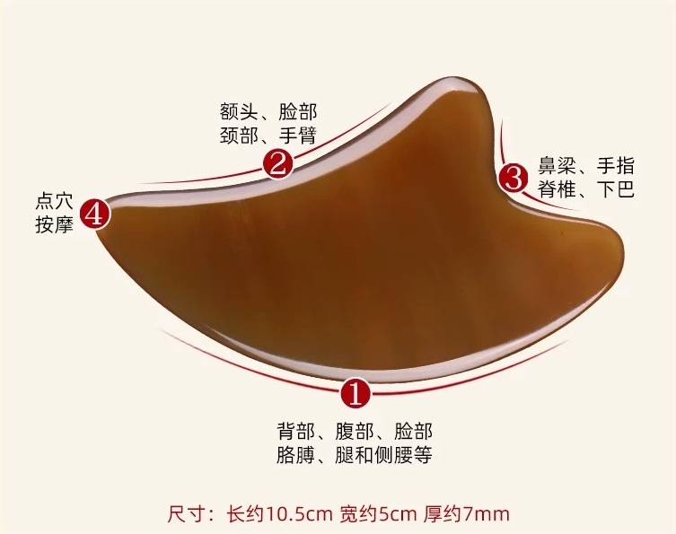
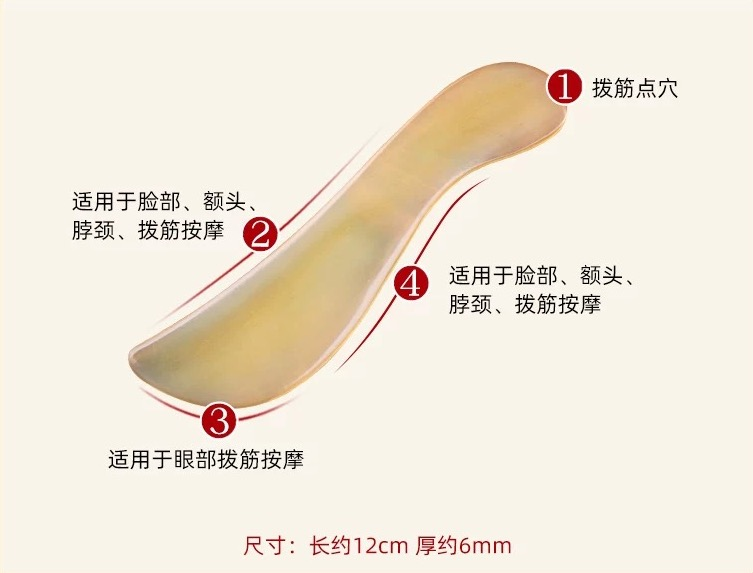
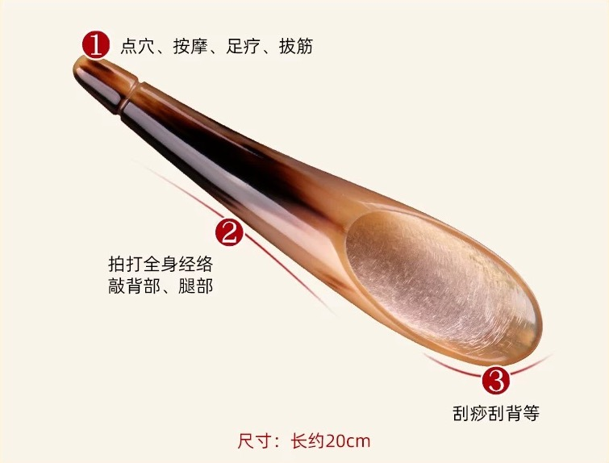

# 什麼是刮痧？
刮痧，顧名思義，就是刮出痧（sha），痧指的是治療後皮膚上可能出現的紅色斑點或瘀點。它是一種手動療法，在塗抹潤滑劑的皮膚上用光滑的工具反覆加壓刮拭。刮痧的動作會產生輕微的瘀點，中醫認為這是將停滯的血液、能量和毒素從底層組織釋放出來的治療表現。雖然瘀點的出現可能看起來令人擔憂，但它們通常是無痛的，並會在幾天內消退。

 
[Image Reference](https://www.cosmopolitan.com.hk/beauty/gua-sha-benefits)

## 刮痧的原理是什麼？
根據中醫理論，刮痧的作用機制如下：

- 活血化瘀：刮痧被認為可以疏通經絡，促進氣（生命能量）和血液的順暢流動。這種改善的循環被認為可以減輕疼痛、炎症和其他症狀。
- 排出毒素：中醫從業者認為刮痧有助於通過皮膚排出體內的毒素。
- 刺激免疫系統：刮痧引發的炎症反應被認為可以增強免疫系統並幫助癒合。
- 減輕炎症：雖然最初的刮痧可能會產生一些炎症，但人們相信它的整體效果是減少治療部位的炎症。

## 刮痧板的形式

## 刮痧板的種類
刮痧板是進行刮痧療法的主要工具，其材質和形狀各異，適合不同的使用需求。以下是一些常見的刮痧板種類：

1. 牛角刮痧板
	- 材質：由天然牛角製成，具有良好的韌性和光滑度。
	- 特點：天然材質，對皮膚刺激較小，適合敏感肌膚。
	- 用途：常用於全身刮痧，特別是面部和頸部。
2. 玉石刮痧板
	- 材質：由玉石製成，通常是綠玉或白玉。
	- 特點：質地堅硬且光滑，具有天然的涼感，有助於舒緩肌膚。
	- 用途：適合用於面部刮痧，因其涼感有助於消腫和緊緻肌膚。
3. 水牛角刮痧板
	- 材質：由水牛角製成，與普通牛角相比更為堅硬。
	- 特點：耐用且不易變形，適合用於較大力度的刮痧。
	- 用途：適合用於背部和四肢等大面積部位。
4. 樹脂刮痧板
	- 材質：由合成樹脂製成。
	- 特點：價格相對便宜，重量輕，易於攜帶。
	- 用途：適合初學者和日常使用。
5. 金屬刮痧板
	- 材質：由不銹鋼或其他金屬製成。
	- 特點：堅固耐用，易於清潔和消毒。
	- 用途：適合專業使用，特別是在需要高強度刮痧的情況下。
6. 陶瓷刮痧板
	- 材質：由陶瓷製成。
	- 特點：光滑且具有一定的重量，使用時手感良好。
	- 用途：適合用於面部和頸部，因其光滑的表面不易傷害皮膚。
選擇刮痧板的考量
	- 材質：選擇天然材質的刮痧板，如牛角或玉石，對皮膚較為友好。
	- 形狀：根據使用部位選擇合適的形狀，如面部使用較小的板，背部使用較大的板。
	- 舒適度：選擇手感舒適、易於握持的刮痧板，以便於操作。

選擇合適的刮痧板可以提高刮痧的效果和舒適度，建議根據個人需求和使用部位進行選擇。
## 刮痧的治療作用
- 活血化瘀
- 調整陰陽
- 舒筋通絡
- 信息調整
- 排除毒素
- 行氣活血

## 刮痧適用於哪些症狀
刮痧常用於治療各種病症，包括：

- 肌肉骨骼疼痛：頸痛、背痛、肩痛和其他肌肉酸痛。
- 頭痛和偏頭痛：刮痧可以幫助緩解緊張性頭痛和偏頭痛。
- 感冒和流感：它有時用於緩解發燒、咳嗽和全身酸痛等症狀。
- 呼吸系統問題：刮痧可能有助於治療支氣管炎和哮喘等疾病。
- 消化問題：它可以用於緩解噁心、嘔吐和腹痛。
- 疲勞和失眠：刮痧被認為可以提高能量水平並促進更好的睡眠。

## 如何進行刮痧？
在皮膚上塗抹潤滑劑（如油），然後使用光滑的工具（通常由玉、骨、角或不銹鋼製成）在皮膚上反覆刮拭。刮痧的壓力和方向會根據患者的病情和治療部位進行調整。

 
[Image Reference](https://static.nfapp.southcn.com/content/201803/16/c1028176.html)

## 常見的刮痧油種類
- 植物油：

	- 橄欖油：滋潤皮膚，適合乾性皮膚。
	- 椰子油：具有抗菌和保濕作用，適合敏感肌膚。
	- 芝麻油：溫和且易於吸收，常用於中醫按摩。
- 中草藥油：

	- 紅花油：具有活血化瘀的作用，適合用於緩解肌肉疼痛。
	- 白花油：具有清涼和止痛效果，適合用於頭痛和肌肉酸痛。
	- 風油精：具有清涼和提神作用，適合用於感冒和頭痛。
- 精油混合物：

	- 薰衣草精油：具有放鬆和舒緩作用，適合用於減壓。
	- 薄荷精油：具有清涼和提神作用，適合用於緩解疲勞。
## 如何選擇刮痧油
- 根據皮膚類型選擇：

	- 乾性皮膚：選擇滋潤性強的油，如橄欖油或椰子油。
	- 敏感皮膚：選擇溫和的植物油或經過稀釋的精油。
- 根據症狀選擇：

	- 緩解肌肉疼痛：選擇具有活血化瘀作用的油，如紅花油。
	- 放鬆和減壓：選擇具有舒緩作用的精油，如薰衣草精油。
- 根據個人偏好選擇：

	- 氣味：選擇自己喜歡的香味，以提高刮痧的舒適度。
	- 質地：選擇易於塗抹且不油膩的油。
- 注意過敏反應：

	- 在使用新油之前，建議先在小面積皮膚上進行測試，以確保不過敏。

## 副作用和注意事項：
刮痧在由訓練有素的從業者操作時通常是安全的。但是，可能會出現一些輕微的副作用，包括：

- 暫時性瘀傷和瘀點
- 治療期間輕微不適
- 皮膚敏感

### <b>在某些情況下應避免刮痧，例如：</b>
- 開放性傷口或割傷
- 有皮膚感染或皮疹的區域
- 出血性疾病
- 懷孕期間（應避免某些區域）
- 植入醫療器械的區域

## 刮痧與其他療法的關係
1. 與針灸的關係
	- 互補作用：刮痧和針灸都旨在調節氣血和經絡，但方法不同。針灸通過刺激特定穴位來調節內部能量，而刮痧則通過表面刺激促進血液循環。兩者可以互補使用，以增強療效。
	- 應用範圍：針灸常用於深層問題，如內臟功能失調，而刮痧更適合表層問題，如肌肉緊張和感冒。
2. 與推拿的關係
	- 協同效果：推拿和刮痧都涉及手法操作，推拿著重於深層肌肉和關節的放鬆，而刮痧則著重於表層的血液循環。兩者結合可以提供更全面的肌肉和經絡調理。
	- 適用人群：推拿適合需要深層放鬆的人群，而刮痧則適合需要快速緩解表層症狀的人。
3. 與拔罐的關係
	- 相似性：刮痧和拔罐都利用物理刺激來促進血液循環和排毒。兩者都可能在皮膚上留下痕跡（瘀斑）。
	- 不同點：拔罐主要利用負壓，而刮痧則是通過摩擦。兩者可以根據具體症狀選擇使用，或結合使用以增強效果。
4. 與草藥療法的關係
	- 內外結合：草藥療法通過內服或外用來調節身體機能，刮痧則是外部刺激。兩者結合可以內外兼治，提高療效。
	- 綜合治療：在中醫治療中，常常將草藥療法與刮痧結合使用，以針對不同層面的健康問題。
5. 綜合療法的應用
	- 整體觀念：中醫強調整體觀念，認為身體各部分是相互聯繫的。刮痧與其他療法的結合使用體現了這一觀念，通過多種方法的協同作用來達到最佳的健康狀態。
	- 個性化治療：根據患者的具體情況，專業人士會選擇合適的療法組合，以提供個性化的治療方案。
## 刮痧療法的操作種類

刮痧分持具療法與徒手操作兩大類，持具療法包括刮痧法、挑痧法、放痧法。徒手操作又叫撮痧法，包括揪痧法、扯痧法、擠痧法、焠痧法、拍痧法。

### 持具療法
持具療法是指使用特定工具進行的刮痧技術，主要包括以下幾種：

1. 刮痧法：又分直接和間接刮法。直接法是利用刮痧板直接接觸患者皮膚，間接法是在患者皮膚上蓋一層薄布，在布上刮；此法可以保護皮膚，適用於兒童、年老體弱、高熱、中樞神經系統感染、抽搐、某些皮膚病患者。

	- 工具：使用刮痧板（如牛角、玉石或樹脂板）。
	- 方法：在皮膚上塗抹潤滑劑後，用刮痧板以一定的力度和速度進行刮動。
	- 應用：促進血液循環，緩解肌肉疼痛，常用於背部、肩膀和四肢。

2. 挑痧法：

	- 工具：使用三棱針。
	- 方法：一手捏起皮肉，另一手以三棱針對準部位將針刺入皮膚，挑破皮膚月0.2～0.3釐米，然後再深入皮下挑斷皮下白色纖維組織或青筋。有白色纖維的地方挑盡為止；青筋的地方挑3下，用雙手擠出瘀血。最後消毒包紮。針對特定穴位或經絡進行輕挑，以刺激氣血流動。
	- 應用：用於特定症狀的治療，如局部疼痛或經絡不通。

3. 放痧法：

	- 工具：使用三棱針。
	- 方法：在刮痧過程中，結合放血技術，輕微刺破皮膚以排出瘀血。
	- 應用：適用於瘀血較重的情況，需由專業人士操作。

### 徒手操作（撮痧法）
徒手操作又稱為撮痧法，完全依靠手法進行，主要包括以下幾種：

1. 揪痧法：

	- 方法：施術者五指屈曲。用食指、中指的第二指節捏住皮膚輕輕揪起，並瞬間用力向外滑動再鬆開，反覆進行，發出「巴巴」聲響。
	- 應用：適合面部和頸部，幫助緊緻肌膚和促進血液循環。

2. 扯痧法：

	- 方法：用食指、大拇指提扯皮膚，輕輕拉扯，使表淺皮膚部位出現紫紅或暗紅的痧點。
	- 應用：放鬆肌肉和改善局部血液循環，主要用於頭部、頸項、背部或面部的太陽穴和印堂穴。

3. 擠痧法：

	- 方法：用食指、大拇指在部位用力擠壓直至紫紅痧斑。
	- 應用：用於頭額部位。

4. 焠痧法：

	- 方法：用燈心草沾油，點燃後在皮膚表面的紅點處燃燒，手法要快，一接觸皮膚就立即離開，常會聽到清脆的寶響聲。
	- 應用：適用於寒症，如腹痛、手足發冷。

5. 拍痧法：

	- 方法：用虛掌拍打皮膚，力度適中。
	- 應用：用於促進雙肘內側和膝蓋或大腿內側血液循環和放鬆肌肉，適合日常保健。

## 刮痧的療程

刮痧治療無嚴格的療程之分，在治療時，為便於觀察治療反應及療效，根據病情的輕重緩急，大致確定療程如下：
- 每次治療間隔5～7日，痧點消失後或患處無痛感時再實施。
- 通常連續治療7～10次為一個療程間隔10日再進行下個療程。
- 如兩個療程後仍無效果，應進一步檢查或改用其他療法。

## 刮痧的順序

- 刮痧時，對人體的整體順序應該為先頭頸部、背部、腰部，然後腹部、胸部，最後刮上肢、下肢。
- 刮拭的方向都是由上而下，胸部由內向外。
- 各部位先刮陽經，後刮陰經。
- 先刮人體左側，再刮人體右側。

## 刮痧板的運板方法
- 面刮法
	- 方法：使用刮痧板的平面部分，傾斜30º到65º，通常為45º，輕輕地在皮膚上進行刮動。
	- 應用：適合平坦大面積部位，如背部和大腿。
	- 特點：動作平穩，力度均勻，促進血液循環。
- 平刮法

- 推刮法
- 單角刮法
- 雙角刮法
- 點按法
- 厲刮法
- 平面按揉法
- 垂直按揉法
- 特殊刮痧法
	- 揉刮法
	- 摩刮法