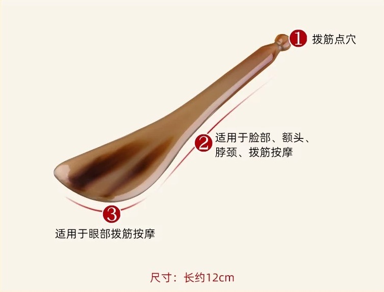

# 什麼是刮痧？
刮痧，顧名思義，就是刮出痧（sha），痧指的是治療後皮膚上可能出現的紅色斑點或瘀點。它是一種手動療法，在塗抹潤滑劑的皮膚上用光滑的工具反覆加壓刮拭。刮痧的動作會產生輕微的瘀點，中醫認為這是將停滯的血液、能量和毒素從底層組織釋放出來的治療表現。雖然瘀點的出現可能看起來令人擔憂，但它們通常是無痛的，並會在幾天內消退。

 
[Image Reference](https://www.cosmopolitan.com.hk/beauty/gua-sha-benefits)

## 刮痧的原理是什麼？
根據中醫理論，刮痧的作用機制如下：

- 活血化瘀：刮痧被認為可以疏通經絡，促進氣（生命能量）和血液的順暢流動。這種改善的循環被認為可以減輕疼痛、炎症和其他症狀。
- 排出毒素：中醫從業者認為刮痧有助於通過皮膚排出體內的毒素。
- 刺激免疫系統：刮痧引發的炎症反應被認為可以增強免疫系統並幫助癒合。
- 減輕炎症：雖然最初的刮痧可能會產生一些炎症，但人們相信它的整體效果是減少治療部位的炎症。

## 刮痧板的形式

## 刮痧的治療作用
- 活血化瘀
- 調整陰陽
- 舒筋通絡
- 信息調整
- 排除毒素
- 行氣活血

## 刮痧適用於哪些症狀
刮痧常用於治療各種病症，包括：

- 肌肉骨骼疼痛：頸痛、背痛、肩痛和其他肌肉酸痛。
- 頭痛和偏頭痛：刮痧可以幫助緩解緊張性頭痛和偏頭痛。
- 感冒和流感：它有時用於緩解發燒、咳嗽和全身酸痛等症狀。
- 呼吸系統問題：刮痧可能有助於治療支氣管炎和哮喘等疾病。
- 消化問題：它可以用於緩解噁心、嘔吐和腹痛。
- 疲勞和失眠：刮痧被認為可以提高能量水平並促進更好的睡眠。

## 如何進行刮痧？
在皮膚上塗抹潤滑劑（如油），然後使用光滑的工具（通常由玉、骨、角或不銹鋼製成）在皮膚上反覆刮拭。刮痧的壓力和方向會根據患者的病情和治療部位進行調整。

 
[Image Reference](https://static.nfapp.southcn.com/content/201803/16/c1028176.html)

## 常見的刮痧油種類
- 植物油：

	- 橄欖油：滋潤皮膚，適合乾性皮膚。
	- 椰子油：具有抗菌和保濕作用，適合敏感肌膚。
	- 芝麻油：溫和且易於吸收，常用於中醫按摩。
- 中草藥油：

	- 紅花油：具有活血化瘀的作用，適合用於緩解肌肉疼痛。
	- 白花油：具有清涼和止痛效果，適合用於頭痛和肌肉酸痛。
	- 風油精：具有清涼和提神作用，適合用於感冒和頭痛。
- 精油混合物：

	- 薰衣草精油：具有放鬆和舒緩作用，適合用於減壓。
	- 薄荷精油：具有清涼和提神作用，適合用於緩解疲勞。
## 如何選擇刮痧油
- 根據皮膚類型選擇：

	- 乾性皮膚：選擇滋潤性強的油，如橄欖油或椰子油。
	- 敏感皮膚：選擇溫和的植物油或經過稀釋的精油。
- 根據症狀選擇：

	- 緩解肌肉疼痛：選擇具有活血化瘀作用的油，如紅花油。
	- 放鬆和減壓：選擇具有舒緩作用的精油，如薰衣草精油。
- 根據個人偏好選擇：

	- 氣味：選擇自己喜歡的香味，以提高刮痧的舒適度。
	- 質地：選擇易於塗抹且不油膩的油。
- 注意過敏反應：

	- 在使用新油之前，建議先在小面積皮膚上進行測試，以確保不過敏。

## 副作用和注意事項：
刮痧在由訓練有素的從業者操作時通常是安全的。但是，可能會出現一些輕微的副作用，包括：

- 暫時性瘀傷和瘀點
- 治療期間輕微不適
- 皮膚敏感

### <b>在某些情況下應避免刮痧，例如：</b>
- 開放性傷口或割傷
- 有皮膚感染或皮疹的區域
- 出血性疾病
- 懷孕期間（應避免某些區域）
- 植入醫療器械的區域